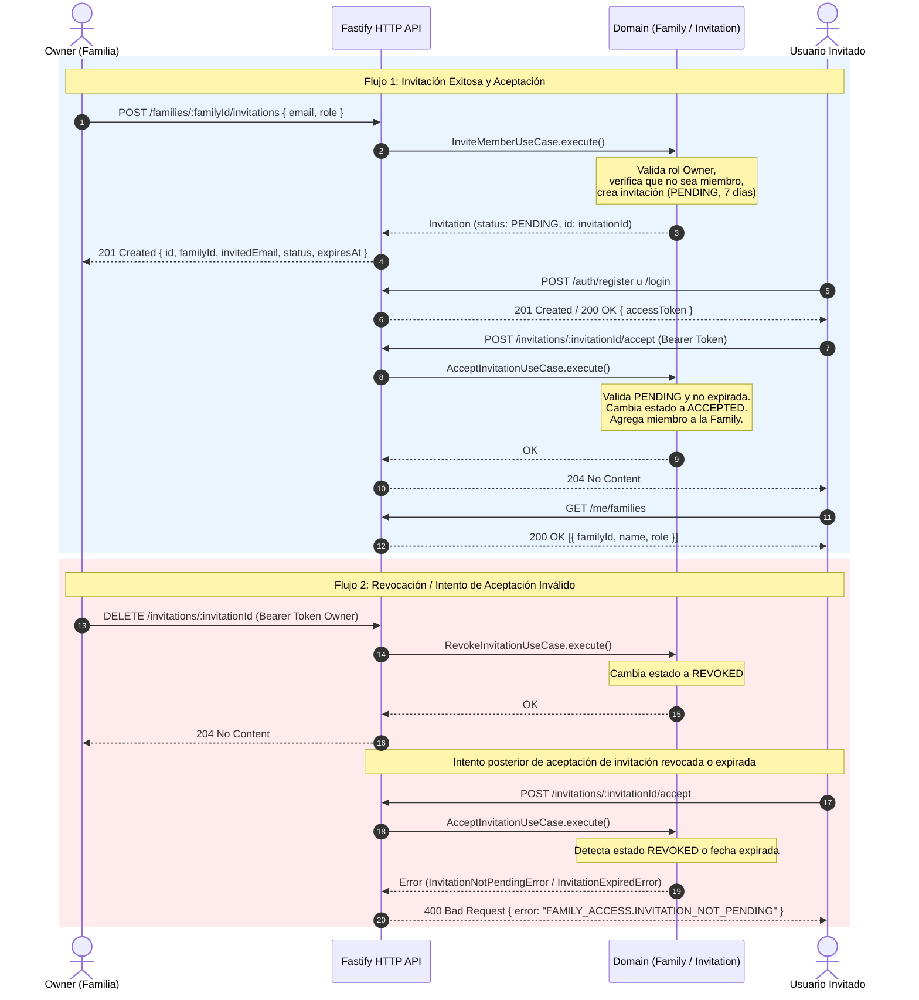

# Flujo de Invitación y Aceptación de Miembros (Invite Member Flow)

Este documento describe el funcionamiento del flujo de invitación de nuevos miembros a una familia en **FamilyFin AI**, detallando la secuencia de endpoints HTTP, las reglas de negocio y los flujos de aceptación, revocación y expiración.

---

## 1. Orden de Endpoints y Secuencia del Flujo

### A. Flujo de Invitación Exitosa y Aceptación

```
[ Owner ]                            [ Backend ]                    [ Usuario Invitado ]
    |                                     |                                   |
    |--- 1. POST /families/:id/invitations ->|                                   |
    |    (email, role)                    |                                   |
    |<-- 201 Created (invitationId) ------|                                   |
    |                                     |                                   |
    |                                     |<-- 2. POST /auth/register u /login|
    |                                     |    (obtiene accessToken) -------->|
    |                                     |                                   |
    |                                     |<-- 3. POST /invitations/:id/accept|
    |                                     |    (Bearer accessToken)           |
    |                                     |--- 204 No Content --------------->|
    |                                     |                                   |
    |                                     |<-- 4. GET /me/families -----------|
    |                                     |    (verifica nueva membresía) --->|
```

#### Paso 1: Crear la invitación (`POST /families/:familyId/invitations`)
- **Actor**: El **Owner** de la familia (requiere cabecera `Authorization: Bearer <accessToken_owner>`).
- **Ruta**: `/families/:familyId/invitations`
- **Cuerpo de la solicitud (JSON)**:
  ```json
  {
    "email": "nuevo.miembro@ejemplo.com",
    "role": "MEMBER"
  }
  ```
- **Lógica de negocio**:
  1. Verifica que el solicitante sea miembro con rol `OWNER`.
  2. Valida que el email no sea ya un miembro de la familia (lanza `AlreadyMemberError` / HTTP `409` si ya pertenece).
  3. Genera una invitación con estado `PENDING` y fecha de expiración a 7 días.
- **Respuesta exitosa (`201 Created`)**:
  ```json
  {
    "id": "b1a2c3d4-...",
    "familyId": "f73c892a-...",
    "invitedEmail": "nuevo.miembro@ejemplo.com",
    "role": "MEMBER",
    "status": "PENDING",
    "expiresAt": "2026-09-15T12:00:00.000Z"
  }
  ```

#### Paso 2: Autenticación del usuario invitado (`POST /auth/register` o `POST /auth/login`)
- **Actor**: El usuario receptor del email (`nuevo.miembro@ejemplo.com`).
- **Acción**: Si no posee cuenta en la plataforma, se registra mediante `POST /auth/register`. Si ya posee cuenta, inicia sesión en `POST /auth/login`.
- **Resultado**: Obtiene su `accessToken` para operar en la API.

#### Paso 3: Aceptar la invitación (`POST /invitations/:invitationId/accept`)
- **Actor**: El usuario invitado autenticado (requiere `Authorization: Bearer <accessToken_invitado>`).
- **Ruta**: `/invitations/:invitationId/accept`
- **Lógica de negocio**:
  1. Busca la invitación por su `invitationId`.
  2. Valida que la invitación esté en estado `PENDING` (`InvitationNotPendingError` / HTTP `400` si ya fue procesada).
  3. Valida que la invitación no haya expirado (`InvitationExpiredError` / HTTP `400` si transcurrieron más de 7 días).
  4. Actualiza el estado de la invitación a `ACCEPTED`.
  5. Agrega al usuario como miembro de la `Family` con el rol asignado (`MEMBER` u `OWNER`).
- **Respuesta exitosa (`204 No Content`)**.

#### Paso 4: Confirmar la membresía (`GET /me/families`)
- **Actor**: El usuario invitado.
- **Ruta**: `/me/families`
- **Respuesta**: Devuelve el listado de familias del usuario, incluyendo la nueva familia a la que se acaba de unirse.

---

### B. Flujo de Revocación y Rechazo de Invitación

El flujo de rechazo o cancelación de una invitación puede ocurrir por dos vías:

1. **Revocación por parte del Owner (`DELETE /invitations/:invitationId`)**:
   - El Owner que envió la invitación decide cancelarla antes de que sea aceptada.
   - Envía `DELETE /invitations/:invitationId` con su token de Owner.
   - La invitación cambia su estado a `REVOKED`.
   - Si el usuario invitado intenta posteriormente aceptarla con `POST /invitations/:invitationId/accept`, el sistema la rechaza con `InvitationNotPendingError` (HTTP `400`).

2. **Expiración automática por tiempo (7 días)**:
   - Pasados 7 días desde la creación, la invitación expira.
   - Si el usuario intenta aceptarla, la entidad `Invitation` valida la fecha actual contra `expiresAt` y responde con `InvitationExpiredError` (HTTP `400`).

3. **Rechazo implícito por parte del invitado**:
   - El usuario invitado simplemente ignora la invitación o la rechaza en la interfaz. Al no ejecutarse el endpoint de aceptación, el estado permanece en `PENDING` hasta su expiración o revocación.

---

## 2. Diagrama de Secuencia (Mermaid)



---

## 3. Resumen de Errores de Dominio Relacionados

| Error de Dominio | Código HTTP | Causa |
|---|---|---|
| `AlreadyMemberError` | `409 Conflict` | El email invitado ya pertenece a la familia. |
| `InsufficientRoleError` | `403 Forbidden` | Quien envía o revoca la invitación no es `OWNER`. |
| `InvitationNotFoundError` | `404 Not Found` | No existe la invitación con la ID proporcionada. |
| `InvitationNotPendingError` | `400 Bad Request` | Se intentó aceptar o revocar una invitación que no está en estado `PENDING` (ya aceptada o revocada). |
| `InvitationExpiredError` | `400 Bad Request` | Se intentó aceptar una invitación cuya fecha `expiresAt` ya transcurrió. |
